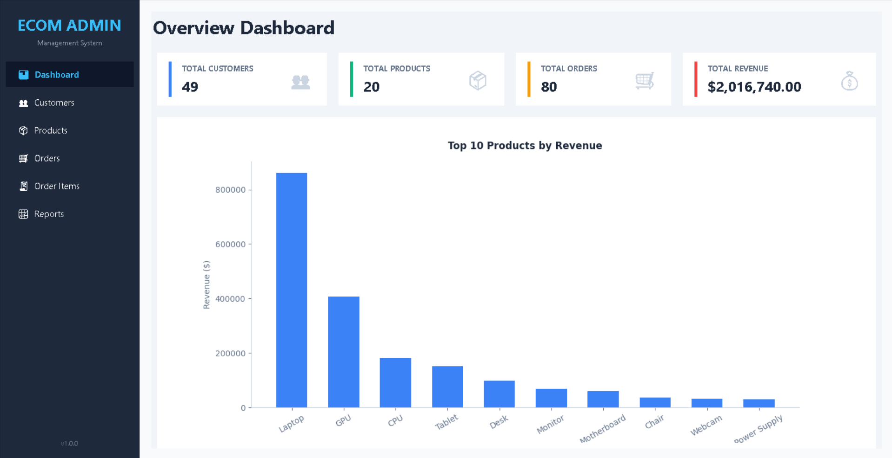
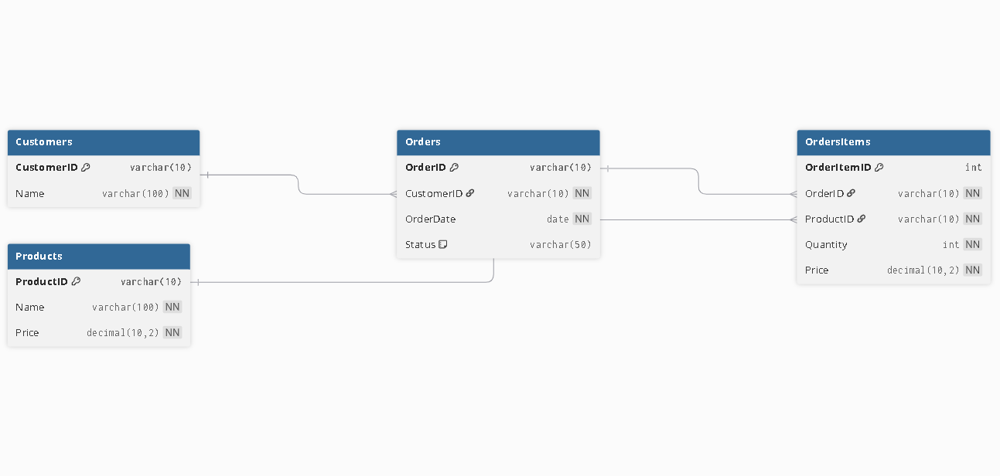
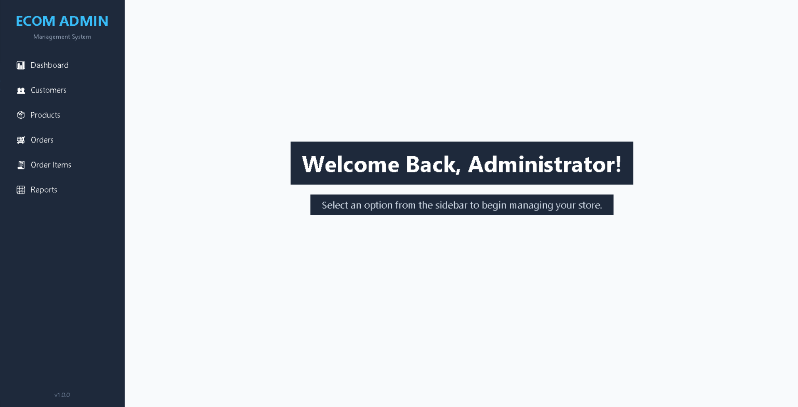
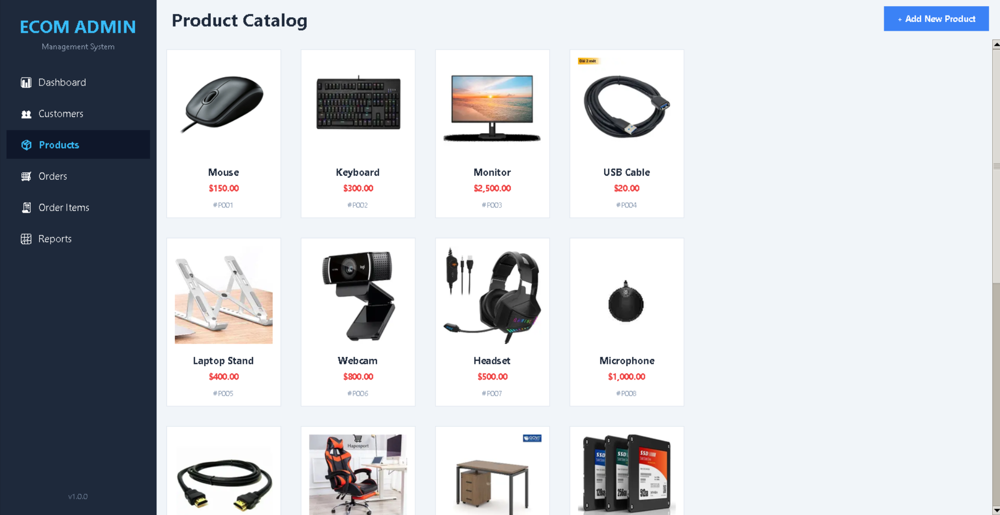
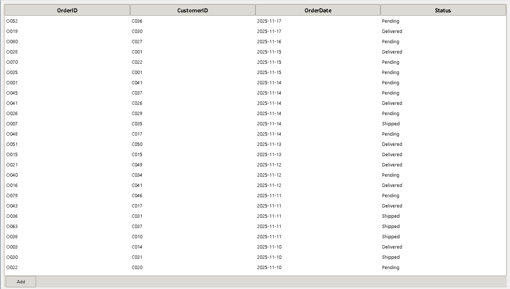

# E-Commerce Manager Pro 🛒


A comprehensive desktop application for managing retail operations, built with **Python** and **MySQL**. This project demonstrates a full-cycle development process from Database Normalization (3NF) to GUI implementation and Reporting.



## 📋 Table of Contents
- [Overview](#-overview)
- [Key Features](#-key-features)
- [Technology Stack](#-technology-stack)
- [Database Design](#-database-design)
- [Installation & Setup](#-installation--setup)
- [Screenshots](#-screenshots)
- [Authors](#-authors)

## 📖 Overview
**E-Commerce Manager Pro** solves the problem of manual record-keeping for small businesses. It allows administrators to track customers, manage a visual product inventory, process orders, and generate sales reports in real-time.

The project highlights:
- **Data Integrity:** Database strictly normalized to **3NF**.
- **Modern UI:** Clean interface using Tkinter with custom styling and Card UI.
- **Analytics:** Data processing with **Pandas** and visualization with **Matplotlib**.
- **Resource Handling:** Dynamic image loading for products using **Pillow**.

## ✨ Key Features
1.  **Welcome Screen:** Professional hero interface for a modern first impression.
2.  **Dashboard:** Real-time KPIs (Revenue, Orders, Customers) and "Top 10 Selling Products" chart.
3.  **Visual Product Catalog:** Grid view with product images, automatic fallback for missing images.
4.  **Order Processing:** Full CRUD operations with automatic data validation.
5.  **Reporting Engine:**
    - Detailed Sales Report (Multi-Table Joins).
    - Export data to CSV/Excel.
6.  **Unit Testing:** Automated tests for revenue calculation logic using `pytest`.

## 🛠 Technology Stack
* **Language:** Python 3.10+
* **GUI Framework:** Tkinter (Standard Lib)
* **Image Processing:** Pillow (PIL)
* **Database:** MySQL 8.0+
* **Data Analysis:** Pandas, NumPy
* **Visualization:** Matplotlib
* **Testing:** Pytest

## 🗄 Database Design
The database schema follows the **Third Normal Form (3NF)** to ensure no data redundancy.



* **Customers:** Stores customer identity.
* **Products:** Inventory items with pricing.
* **Orders:** Transaction headers (Date, Status).
* **OrdersItems:** Transaction details (Line items with snapshot price).

## 🚀 Installation & Setup

### Prerequisites
- Python 3.10 or higher.
- MySQL Server installed and running.

### Step 1: Clone the Repository
```bash
git clone [https://github.com/YOUR_USERNAME/ecommerce-order-manager.git](https://github.com/YOUR_USERNAME/ecommerce-order-manager.git)
cd ecommerce-order-manager
```
### Step 2: Install Dependencies
```bash
pip install -r requirements.txt
```
### Step 3: Database Configuration
1.  Open **MySQL Workbench** or your preferred SQL tool.
2.  Run the script `schema.sql` to create the database structure.
3.  Run the script `seed.sql` to populate sample data.
4.  Create a `.env` file in the root directory (if required) or update DB credentials in `app/core/connection.py`.

### Step 4: Run the Application
```bash
python -m app.main
```
## 📸 Screenshots

### Welcome Screen


### Dashboard Overview


### Product Catalog (Grid View)


### Order Management


## 👥 Authors
**Group Project - National Economics University (NEU)**
* **Be Thanh Tien** (ID: 11247357)
* **Pham Ba Viet** (ID: 11247371)
* **Hoang Thi Phuong Linh** (ID: 11247308)


**Supervisor:** Tran Hung

---
*Created for the "Database Systems" Midterm Project.*
